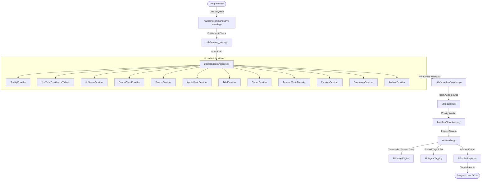

<div align="center">

# 🎵 SpotiVerse

### Modular & Asynchronous Telegram Music Downloader Bot with Multi-Provider Engine, Extended Audio Formats & Hi-Res Quality Architecture

[](https://www.python.org/)
[](https://docs.pyrogram.org/)
[](https://www.mongodb.com/)
[](https://www.docker.com/)
[](LICENSE)
[](https://github.com/IceCube9680/SpotiVerse)

<p align="center">
  A state-of-the-art, high-performance Telegram music bot built with <b>Pyrogram v2</b>, <b>yt-dlp</b>, and <b>FFmpeg</b>.<br>
  Search, stream, and download tracks, albums, and playlists across <b>13 music ecosystems</b> (Spotify, YouTube, YouTube Music, JioSaavn, SoundCloud, Deezer, Apple Music, TIDAL, Qobuz, Amazon Music, Pandora, Bandcamp, Internet Archive) in <b>12+ audio formats & containers</b> up to <b>24-bit 192 kHz Hi-Res Lossless Master Quality</b>.<br>
  Features intelligent <b>Audio Source Quality Detection</b>, transparent <b>Anti-Upscaling Warnings</b>, <b>Dynamic Feature Gates</b>, <b>Interactive Admin Panel</b>, and <b>Priority-Aware Queue Scheduling</b>.
</p>

[**Key Features**](#-key-features) • [**Supported Providers**](#-provider-ecosystem) • [**Audio Formats & Hi-Res Quality**](#-extended-audio-formats--quality-profiles) • [**Anti-Upscaling Fidelity Engine**](#-source-quality-detection--fidelity-engine) • [**Admin Panel**](#️-admin-panel--security) • [**Configuration**](#️-environment-variables) • [**Deployment**](#-deployment-options)

---

</div>

## 📑 Table of Contents

- [✨ Key Features](#-key-features)
- [🔌 Provider Ecosystem (13 Platforms)](#-provider-ecosystem)
- [🎵 Extended Audio Formats & Quality Profiles](#-extended-audio-formats--quality-profiles)
- [🔍 Source Quality Detection & Fidelity Engine](#-source-quality-detection--fidelity-engine)
- [🛡️ Admin Panel & Security](#️-admin-panel--security)
- [👑 Premium Ecosystem & Feature Gates](#-premium-ecosystem--feature-gates)
- [📊 Statistics Dashboard](#-statistics-dashboard)
- [🏗️ Architecture & Flow](#️-architecture--flow)
- [🚀 Quickstart Guide](#-quickstart-guide)
- [⚙️ Environment Variables](#️-environment-variables)
- [🤖 Bot Commands](#-bot-commands)
- [📦 Deployment Options](#-deployment-options)
- [🔧 Troubleshooting & FAQ](#-troubleshooting--faq)
- [⚖️ Legal & Disclaimer](#️-legal--disclaimer)
- [📄 License](#-license)

---

## ✨ Key Features

- **🌐 13 Unified Music Providers**
  Seamless search, metadata extraction, and source resolution across **Spotify**, **YouTube**, **YouTube Music**, **JioSaavn**, **SoundCloud**, **Deezer**, **Apple Music**, **TIDAL**, **Qobuz**, **Amazon Music**, **Pandora**, **Bandcamp**, and **Internet Archive**.
- **🎧 12+ Audio Formats & Strict Codec/Container Separation**
  Full support for MP3, FLAC, M4A (AAC & ALAC), OGG (Vorbis & Opus), Opus, WAV, AIFF, WavPack (.wv), Monkey's Audio (.ape), AC3, and E-AC3 (.eac3).
- **💎 Studio Hi-Res & Float Quality Profiles**
  Lossy bitrates from 32 kbps to 500 kbps, Lossless FLAC/ALAC from 16-bit 44.1 kHz to 24-bit 192 kHz, and uncompressed Studio PCM/Float up to 32-bit Float 192 kHz.
- **🛡️ Source Fidelity & Anti-Upscaling Warning Transparency**
  Automatic FFprobe deep stream inspection. Native stream copy is utilized when source and target match. Lossy-to-lossless conversions display clear audio degradation notices to prevent deceptive upscaling.
- **🎯 Intelligent Track Matching Engine**
  Normalized title noise-stripping, ISRC 100% confidence matching, artist token intersection, and duration tolerance scoring (0.0–1.0) with configurable rejection thresholds.
- **🖼️ Universal Multi-Container Tagging**
  Embeds cover artwork, ISRC, genre, album artist, release year, disc/track numbers into ID3v2.4, Vorbis Comments, MP4 Atoms, RIFF INFO, AIFF ID3, WavPack APEv2, and Monkey's Audio tags via `mutagen`.
- **⚡ Priority Fair Download Queue**
  Weighted round-robin concurrency scheduler (`PREMIUM_PRIORITY_WEIGHT=3`) with download cancellation, exponential retry backoff, and automatic scratch cleanup.

---

## 🔌 Provider Ecosystem

Every provider implements a unified asynchronous lifecycle interface (`initialize`, `health_check`, `search`, `get_track_info`, `resolve_source`, `get_available_qualities`, `close`).

| Provider | Search | Metadata | Audio Download | Default Auth | Health / Operational Notes |
| :--- | :---: | :---: | :---: | :---: | :--- |
| **Spotify** | ✅ | ✅ | 🔄 Via Matcher | Client ID/Secret or Web Scraper | Search & rich metadata. Stream resolved via matched source. |
| **YouTube** | ✅ | ✅ | ✅ Direct | Public / Cookies | Primary audio extraction engine with format selection. |
| **YouTube Music**| ✅ | ✅ | ✅ Direct | Public / Cookies | High-bitrate Opus (160 kbps) and AAC streams. |
| **JioSaavn** | ✅ | ✅ | ✅ Direct | Public API | Direct 320 kbps MP4/AAC/MP3 audio CDN streams. |
| **SoundCloud** | ✅ | ✅ | ✅ Direct | Public Client ID | Direct 128–256 kbps MP3/Opus streams. |
| **Deezer** | ✅ | ✅ | 🔄 Via Matcher | Public API / ARL | Search & 30s preview; full track resolved via fallback. |
| **Apple Music** | ✅ | ✅ | 🔄 Via Matcher | iTunes Search API | Public metadata & catalog search; matched to high-res source. |
| **TIDAL** | ✅ | ✅ | 🔄 Via Matcher | Public / OAuth | Search & lossless metadata; matched to best available source. |
| **Qobuz** | ✅ | ✅ | 🔄 Via Matcher | Public Catalog / API | Hi-Res 24-bit metadata; matched to lossless candidate. |
| **Amazon Music**| ✅ | ✅ | 🔄 Via Matcher | Public Catalog | Metadata & ASIN catalog; matched to audio source. |
| **Pandora** | ✅ | ✅ | 🔄 Via Matcher | Public / Auth | Search & track metadata; matched to audio source. |
| **Bandcamp** | ✅ | ✅ | ✅ Direct | Public Web Stream | Direct public artist stream & full track metadata. |
| **Internet Archive**| ✅ | ✅ | ✅ Direct | Public Audio Archive | Direct public domain lossless FLAC, VBR MP3, and OGG streams. |

> [!NOTE]
> SpotiVerse strictly respects copyright and digital rights management. For platforms that protect subscriber audio streams, SpotiVerse acts as an authentic metadata/search provider and matches the track against authorized public audio sources (or user-supplied authentication cookies).

---

## 🎵 Extended Audio Formats & Quality Profiles

### Codec & Container Matrix

| Format Name | Container | Audio Codec | Required FFmpeg Encoder | Supported Quality Profiles |
| :--- | :---: | :---: | :---: | :--- |
| **MP3** | `.mp3` | MP3 | `libmp3lame` | 64, 96, 128, 160, 192, 224, 256, 320 kbps |
| **FLAC** | `.flac` | FLAC | `flac` | 16-bit (44.1k, 48k), 24-bit (44.1k, 48k, 88.2k, 96k, 176.4k, 192k) |
| **M4A (AAC)** | `.m4a` | AAC | `aac` | 64, 96, 128, 160, 192, 224, 256, 320 kbps |
| **M4A (ALAC)** | `.m4a` | ALAC | `alac` | 16-bit (44.1k, 48k), 24-bit (44.1k, 48k, 96k, 192k) |
| **OGG (Vorbis)**| `.ogg` | Vorbis | `libvorbis` | 64, 96, 128, 160, 192, 224, 256, 320, 500 kbps |
| **Opus** | `.opus` / `.ogg` | Opus | `libopus` | 32, 48, 64, 96, 128, 160, 192, 256, 320 kbps |
| **WAV** | `.wav` | PCM | `pcm_s16le`, `pcm_s24le`, `pcm_f32le` | 16-bit, 24-bit, 32-bit Float (44.1k, 48k, 96k, 192k) |
| **AIFF** | `.aiff` | PCM | `pcm_s16be`, `pcm_s24be`, `pcm_f32be` | 16-bit, 24-bit, 32-bit Float (44.1k, 48k, 96k, 192k) |
| **WavPack** | `.wv` | WavPack | `wavpack` | Lossless, High, Fast, 16-bit / 24-bit PCM |
| **Monkey's Audio**| `.ape` | APE | `ape` (or lossless copy) | Fast, Normal, High, Extra High |
| **AC3 (Dolby Digital)**| `.ac3` | AC3 | `ac3` | 192, 224, 384, 448, 640 kbps |
| **E-AC3 (Dolby Digital Plus)**| `.eac3` | E-AC3 | `eac3` | 224, 384, 448, 640, 1024 kbps |

---

## 🔍 Source Quality Detection & Fidelity Engine

SpotiVerse adheres to strict audio fidelity principles:

1. **Zero-Loss Stream Preservation (`can_stream_copy`)**: If the incoming source already matches the user's requested codec and container, SpotiVerse skips re-encoding entirely (`-c:a copy`), preserving the exact digital bitstream.
2. **Anti-Upscaling Notice**: If a user requests a lossless format (e.g., FLAC 24-bit/96kHz or WAV) but the source is lossy (e.g., YouTube Opus 160kbps), SpotiVerse attaches a transparent advisory:
   ```
   ⚠️ Audio Fidelity Notice:
   Source: Lossy Opus @ 160 kbps. Converted to FLAC without artificial upscaling.
   ```
3. **Deep Probe Inspection**: Every converted audio file is verified with `ffprobe` prior to Telegram dispatch to confirm output duration, sample rate, bit depth, and bitrate.

---

## 🛡️ Admin Panel & Security

Authorized administrators (`OWNER_ID`, `ADMINS`, `SUDO_USERS`) can access the control center via `/admin`:

```plaintext
🛠 Admin Panel
┌───────────────────────────────┐
│ 📊 Statistics    👑 Premium   │
│ ⚙️ Bot Settings   🔌 Providers │
│ 🔧 Maintenance   👥 Users     │
│ 📢 Broadcast     📜 Logs      │
│ 🚪 Logout        ⬅️ Back      │
└───────────────────────────────┘
```

- **Live Provider Management (`/admin -> 🔌 Providers`)**: Inspect real-time health (`ONLINE`, `DEGRADED`, `AUTH_REQUIRED`, `DISABLED`) and toggle individual platforms on the fly.
- **Runtime Feature Gating**: Enable or disable free/premium tiers, format restrictions, and maintenance mode without restarting the process.
- **Audit Logging**: Every sensitive action is cryptographically recorded with timestamps and admin IDs.

---

## 👑 Premium Ecosystem & Feature Gates

Configure entitlement rules centrally via environment variables:

| Setting | Free Tier | Premium Tier |
| :--- | :---: | :---: |
| **Daily Quota** | `FREE_USER_DAILY_LIMIT` (e.g., 5/day) | Unlimited |
| **Allowed Formats** | `FREE_AUDIO_FORMATS` (`mp3`) | `PREMIUM_AUDIO_FORMATS` (`mp3, flac, m4a, ogg, wav, aiff, opus, wv, ape, ac3, eac3`) |
| **Allowed Qualities** | Standard (64k–320k) | Standard, Studio Lossless, 24-bit Hi-Res & 32-bit Float |
| **Batch Downloading**| Single Tracks | Playlists & Full Albums |
| **Queue Priority** | Standard FIFO | 3x Weighted Priority Scheduling |

---

## 📊 Statistics Dashboard

Database-aggregated metrics across **24 Hours**, **7 Days**, **30 Days**, and **All-Time**:

```plaintext
📊 Statistics (Last 30 Days)

👥 Users:
• Total Registered: 12,540
• Active: 4,120 | Premium: 842

📥 Downloads:
• Total Attempts: 93,412
• Successful: 90,050 | Failed: 3,362
• Success Rate: 96.4%

🎵 Formats & Queues:
• MP3: 72,100 | FLAC: 12,950 | M4A: 3,200 | Opus: 1,800
• Active In-Flight: 2 | Queued: 0

🔥 Top Platforms (Successful):
• YouTube / YT Music: 42,100 (46.8%)
• Spotify:            28,300 (31.4%)
• JioSaavn:           12,200 (13.5%)
• SoundCloud:          5,100 (5.7%)
• Deezer & Others:     2,350 (2.6%)

⏱️ System:
• Uptime: 4d 12h 30m | DB: Connected
```

---

## 🏗️ Architecture & Flow



---

## 🚀 Quickstart Guide

### Prerequisites

- **Python**: Version `3.10` or higher (`python3 --version`)
- **FFmpeg**: Installed with required audio encoders (`ffmpeg -encoders`)
- **Telegram Credentials**:
  - `API_ID` & `API_HASH` from [my.telegram.org](https://my.telegram.org)
  - `BOT_TOKEN` from [@BotFather](https://t.me/BotFather)
- **MongoDB Atlas**: Free cluster or local instance (In-memory fallback is automatic)

### Standard Installation

1. **Clone the Repository**
   ```bash
   git clone https://github.com/IceCube9680/SpotiVerse.git
   cd SpotiVerse
   ```

2. **Set Up Virtual Environment**
   ```bash
   python3 -m venv venv
   source venv/bin/activate
   ```

3. **Install Dependencies & FFmpeg**
   ```bash
   sudo apt update && sudo apt install -y ffmpeg curl
   pip install --upgrade pip
   pip install -r requirements.txt
   ```

4. **Configure Environment**
   ```bash
   cp .env.sample .env
   nano .env
   ```

5. **Run the Bot**
   ```bash
   python3 bot.py
   ```

---

## ⚙️ Environment Variables

Configure your `.env` file using the parameters below:

| Variable | Type | Required | Default | Description |
| :--- | :---: | :---: | :---: | :--- |
| `BOT_TOKEN` | `String` | **Yes** | — | Telegram Bot token obtained from [@BotFather](https://t.me/BotFather). |
| `API_ID` | `Integer` | **Yes** | — | Telegram API ID from [my.telegram.org](https://my.telegram.org). |
| `API_HASH` | `String` | **Yes** | — | Telegram API Hash from [my.telegram.org](https://my.telegram.org). |
| `OWNER_ID` | `Integer` | **Yes** | `0` | Telegram user ID of the primary bot owner. |
| `ADMINS` / `SUDO_USERS` | `List[Int]` | No | `[]` | List of admin Telegram user IDs. |
| `MONGO_URI` | `String` | No | *In-Memory* | MongoDB Atlas connection URI (`mongodb+srv://...`). |
| `PREMIUM` / `PREMIUM_MODE` | `Boolean` | No | `True` | Global premium feature enforcement flag. |
| `FREE_USER_DAILY_LIMIT` | `Integer` | No | `5` | Daily download quota for free users (`0` to disable). |
| `MAX_CONCURRENT_DOWNLOADS` | `Integer` | No | `3` | Global simultaneous download limit. |
| `PREMIUM_PRIORITY_WEIGHT` | `Integer` | No | `3` | Scheduling ratio for premium vs. free download tasks. |
| `FREE_AUDIO_FORMATS` | `List[String]` | No | `["mp3"]` | Allowed formats for free users. |
| `PREMIUM_AUDIO_FORMATS` | `List[String]` | No | `["mp3", "flac", "m4a", "ogg", "wav", "aiff", "opus", "wv", "ape", "ac3", "eac3"]` | Allowed formats for premium users. |
| `FREE_DOWNLOAD_PROVIDERS` | `List[String]` | No | `["auto", "spotify", "youtube", "youtubemusic", "jiosaavn", "soundcloud"]` | Allowed providers for free users. |
| `PREMIUM_DOWNLOAD_PROVIDERS`| `List[String]` | No | `["auto", "spotify", "youtube", "youtubemusic", "jiosaavn", "soundcloud", "deezer", "applemusic", "tidal", "qobuz", "amazonmusic", "pandora", "bandcamp", "archive"]` | Allowed providers for premium users. |
| `ENABLE_APPLE_MUSIC` | `Boolean` | No | `True` | Enable Apple Music search & metadata resolver. |
| `ENABLE_TIDAL` | `Boolean` | No | `True` | Enable TIDAL search & metadata resolver. |
| `ENABLE_QOBUZ` | `Boolean` | No | `True` | Enable Qobuz search & metadata resolver. |
| `ENABLE_AMAZON_MUSIC` | `Boolean` | No | `True` | Enable Amazon Music search & metadata resolver. |
| `ENABLE_PANDORA` | `Boolean` | No | `True` | Enable Pandora search & metadata resolver. |
| `ENABLE_BANDCAMP` | `Boolean` | No | `True` | Enable Bandcamp direct audio downloader. |
| `ENABLE_INTERNET_ARCHIVE` | `Boolean` | No | `True` | Enable Internet Archive direct downloader. |
| `MAX_AUDIO_FILE_SIZE_MB` | `Integer` | No | `50` | Maximum audio upload file size before warning. |

---

## 🤖 Bot Commands

### User Commands

| Command | Aliases | Parameters | Description |
| :--- | :--- | :--- | :--- |
| `/start` | — | None | Starts the bot, registers profile, and displays main menu. |
| `/search` | `/s`, `/find` | `<query>` | Multi-platform search across all enabled providers. |
| `/download` | `/dl`, `/d` | `<url>` or `<query>` | Directly download track, album, or playlist. |
| `/settings` | `/setting`, `/set` | None | Configure Preferred Provider, Audio Format, and Dynamic Quality. |
| `/profile` | `/userinfo`, `/me` | None | Displays membership tier, download stats, and remaining quota. |
| `/premium` | `/prem`, `/plans` | None | Interactive Premium Plans screen & membership upgrade options. |
| `/help` | `/h` | None | Displays interactive help manual and format specifications. |

### Admin & Owner Commands

| Command | Aliases | Parameters | Description |
| :--- | :--- | :--- | :--- |
| `/admin` | `/panel`, `/dashboard` | None | Opens the interactive Telegram Admin Panel. |
| `/stats` | `/stat` | None | Real-time system, user, and download statistics. |
| `/add_premium` | `/give_premium` | `<user_id>` `<duration>` | Grants premium status (`7d`, `30d`, `90d`, `180d`, `1y`, `lifetime`). |
| `/remove_premium` | `/unpremium` | `<user_id>` | Revokes premium status from a user. |
| `/ban` | `/unban` | `<user_id>` | Ban or unban a user from using the bot. |
| `/broadcast` | `/bc` | `<msg>` / Reply | Broadcasts message with progress and delivery stats. |
| `/logs` | `/log` | None | Exports live runtime log stream directly into chat. |

---

## 📦 Deployment Options

### 1. Local Deployment
```bash
git clone https://github.com/IceCube9680/SpotiVerse.git
cd SpotiVerse
python3 -m venv venv && source venv/bin/activate
pip install -r requirements.txt
cp .env.sample .env
python3 bot.py
```

### 2. Docker Container
```bash
docker build -t spotiverse:latest .
docker run -d \
  --name spotiverse_bot \
  --restart unless-stopped \
  --env-file .env \
  -v $(pwd)/data:/app/data \
  spotiverse:latest
```

---

## 🔧 Troubleshooting & FAQ

<details>
<summary><b>1. Admin Panel access</b></summary>

- Only authorized Telegram users configured in `OWNER_ID`, `ADMINS`, or `SUDO_USERS` can access `/admin`.
</details>

<details>
<summary><b>2. YouTube bot detection (HTTP 429)</b></summary>

- Place an exported `cookies.txt` file in the project root to authenticate with YouTube.
</details>

<details>
<summary><b>3. Maintenance Mode behavior</b></summary>

- When Maintenance is enabled, new user downloads are immediately halted with an informative notice. In-flight downloads finish uninterrupted.
</details>

<details>
<summary><b>4. Lossless format warnings</b></summary>

- If a lossy audio source (e.g., 160 kbps Opus) is converted to FLAC/WAV, SpotiVerse automatically adds a transparency note indicating that lost audio information cannot be artificially restored.
</details>

---

## ⚖️ Legal & Disclaimer

> [!IMPORTANT]
> **Educational & Personal Use Only**
> This software is intended for personal research and educational purposes. Ensure compliance with your local laws and third-party terms of service. All trademarks and logos belong to their respective owners.

---

## 📄 License

Distributed under the **MIT License**. See [`LICENSE`](LICENSE) for details.

<div align="center">
  <sub>Built with ❤️ by <a href="https://github.com/IceCube9680">IceCube</a> & <a href="https://github.com/priest9680">Priest Gamer</a></sub>
</div>
